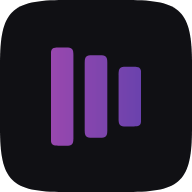
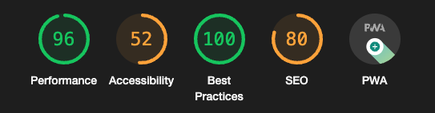
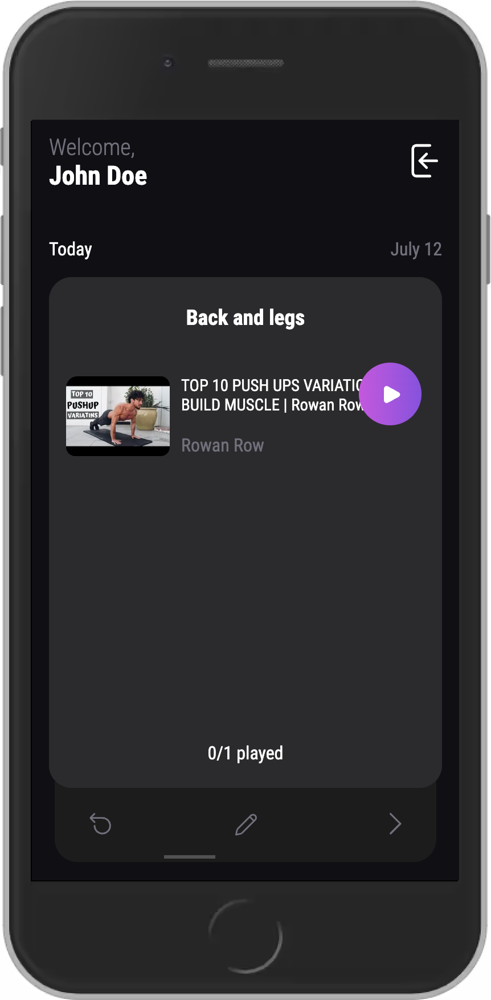
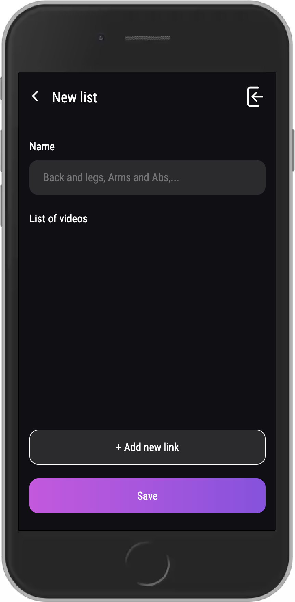
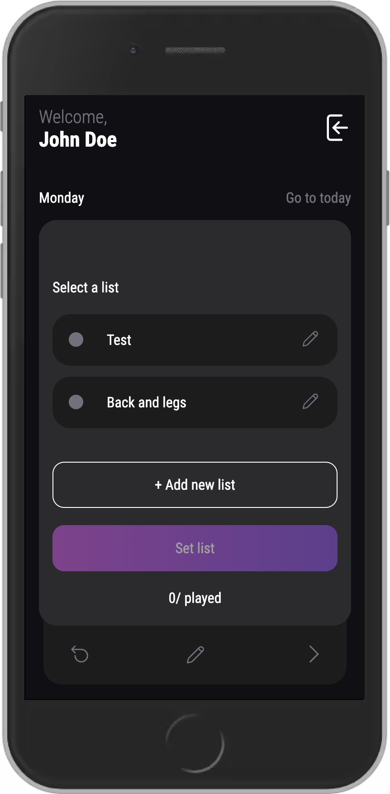
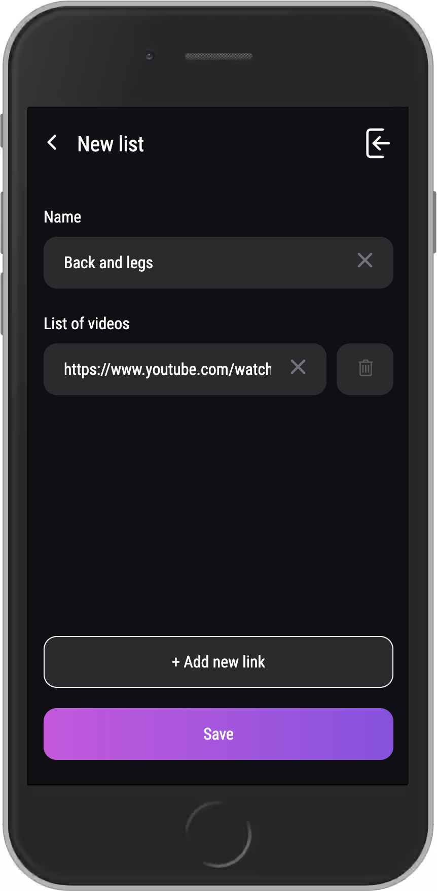
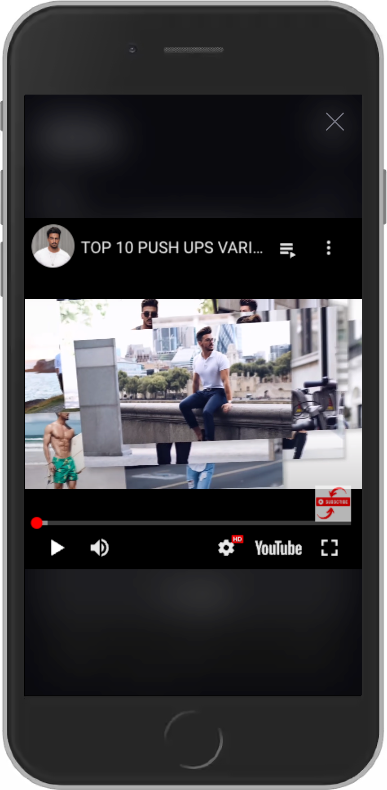

<div id="top"></div>

[![LinkedIn][linkedin-shield]][linkedin-url]

<!-- PROJECT LOGO -->
<br />
<div align="center">
  <a href="https://github.com/mocca-dev/yoketube">
    
  </a>

<h3 align="center">YokeTube</h3>

  <p align="center">
    This app start as a solution for a daily problem and then I ended up using it to put in practice several NextJS concepts and learn about it.
    <br />
    <a href="https://yoketube.vercel.app/">View Demo</a>
  </p>
</div>

<div align="center">
  
</div>
<br>

<!-- TABLE OF CONTENTS -->
<details>
  <summary>Table of Contents</summary>
  <ol>
    <li>
      <a href="#about-the-project">About The Project</a>
      <ul>
        <li><a href="#built-with">Built With</a></li>
      </ul>
    </li>
    <li>
      <a href="#getting-started">Getting Started</a>
      <ul>
        <li><a href="#prerequisites">Installation and Startup</a></li>
      </ul>
    </li>
    <li><a href="#usage">Usage</a>
      <ul>
        <li><a href="#prerequisites">Load and play</a></li>
        <li><a href="#prerequisites">Settings</a></li>
      </ul>
    </li>
    <li><a href="#license">License</a></li>
    <li><a href="#contact">Contact</a></li>
  </ol>
</details>

<!-- ABOUT THE PROJECT -->

## About The Project

<div align="center">
  
</div>
<br>
<br>
<p>
  I was looking for a specific solution for one "problem". I wanted to do my daily workouts from different youtube playlists but the overall process was too complicated. So I ended up creating this app. Here, you will have the ability to create/edit lists and asign them to each day of the week. After that you can just play those lists and enjoy the content.
</p>
<p align="right">(<a href="#top">back to top</a>)</p>

### Built With

- [NextJS 13 ▲](https://nextjs.org)
- [NextAuth.js🛡️](https://next-auth.js.org)
- [MongoDB](https://account.mongodb.com)
- [Mongoose🪿](https://mongoosejs.com)
- [TypeScript](https://www.typescriptlang.org)

<p align="right">(<a href="#top">back to top</a>)</p>

<!-- GETTING STARTED -->

## Getting Started

This app is made with NextJS so the installation process is simple.

### Installation and Startup

1. Clone the repo
   ```sh
   git clone https://github.com/mocca-dev/yoketube
   ```
2. Install NPM packages
   ```sh
   npm install
   ```
3. Finally you have to simply run the app and you're ready to go with the client.
   ```sh
   npm run dev
   ```

<p align="right">(<a href="#top">back to top</a>)</p>

<!-- USAGE EXAMPLES -->

## Usage

### Main Screen

<div align="center">
  
</div>
<br>
When you first enter to the app you will be received by the <strong>Today</strong> card of the week. Here you can just start playing the current list and start to do you favorite workout.
<p align="right">(<a href="#top">back to top</a>)</p>

### New List

<div align="center">
  
</div>
<br>
The first time you open the app you have to create a new list. To do this, you must touch the <strong>+Add new list</strong> button and you will be redirected to the <strong>New list</strong> screen. Here you have to enter a name and the youtube video links that you want in to your new list. When you have finished with name and links just touch the <strong>Save</strong> button.
<p align="right">(<a href="#top">back to top</a>)</p>

### Empty Day

<div align="center">
  
</div>
<br>
After you create your lists you will have to select one, just touch over some list and touch <strong>Set list</strong> button.
<p align="right">(<a href="#top">back to top</a>)</p>

### Editing List

<div align="center">
  
</div>
<br>
If you want to edit a list, just touch the <strong>Edit</strong> icon in the menu bar at the bottom. After that, you have to touch the <strong>Edit</strong> icon again but this time you have to choose the list that you want to edit.
<p align="right">(<a href="#top">back to top</a>)</p>

### Playing List

<div align="center">
  
</div>
<br>
When you are ready with the playlist, just touch the cross in the up right corner of the screen. 
<p align="right">(<a href="#top">back to top</a>)</p>

<!-- LICENSE -->

## License

Distributed under the MIT License. See `LICENSE.txt` for more information.

<p align="right">(<a href="#top">back to top</a>)</p>

<!-- CONTACT -->

## Contact

Nicolás Tonelli - nicolastonelli1406@gmail.com

Project Link: [https://github.com/mocca-dev/yoketube](https://github.com/mocca-dev/yoketube)

<p align="right">(<a href="#top">back to top</a>)</p>

<!-- MARKDOWN LINKS & IMAGES -->
<!-- https://www.markdownguide.org/basic-syntax/#reference-style-links -->

[contributors-shield]: https://img.shields.io/github/contributors/github_username/repo_name.svg?style=for-the-badge
[contributors-url]: https://github.com/github_username/repo_name/graphs/contributors
[forks-shield]: https://img.shields.io/github/forks/github_username/repo_name.svg?style=for-the-badge
[forks-url]: https://github.com/github_username/repo_name/network/members
[stars-shield]: https://img.shields.io/github/stars/github_username/repo_name.svg?style=for-the-badge
[stars-url]: https://github.com/github_username/repo_name/stargazers
[issues-shield]: https://img.shields.io/github/issues/github_username/repo_name.svg?style=for-the-badge
[issues-url]: https://github.com/github_username/repo_name/issues
[license-shield]: https://img.shields.io/github/license/github_username/repo_name.svg?style=for-the-badge
[license-url]: https://github.com/github_username/repo_name/blob/master/LICENSE.txt
[linkedin-shield]: https://img.shields.io/badge/-LinkedIn-black.svg?style=for-the-badge&logo=linkedin&colorB=555
[linkedin-url]: https://linkedin.com/in//nicolás-tonelli-181624b9/
[product-screenshot]: images/screenshot.png
